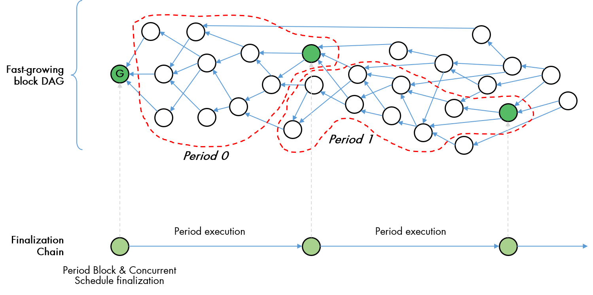
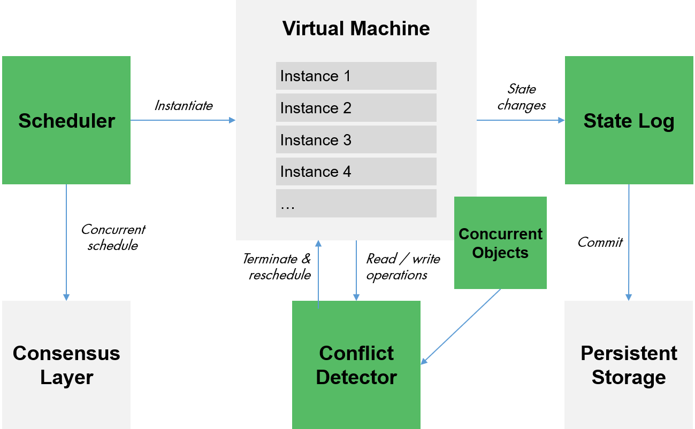
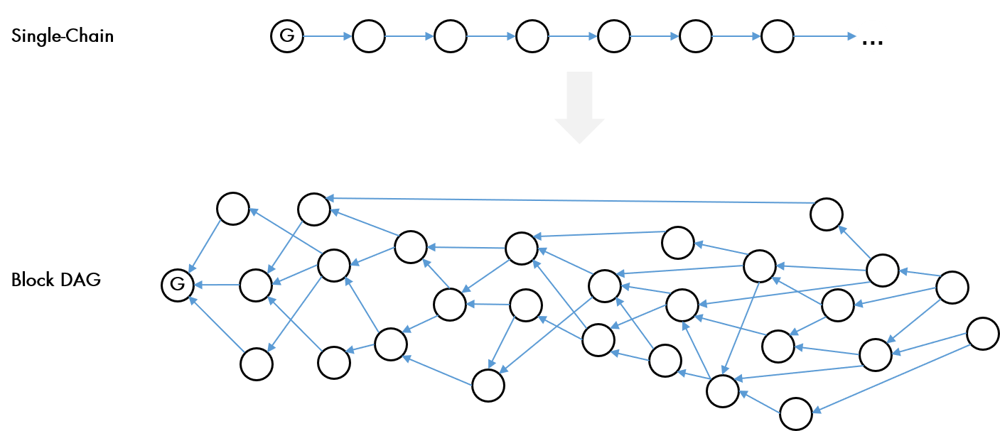
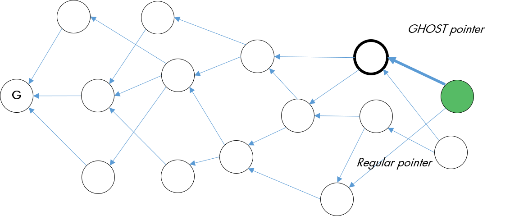
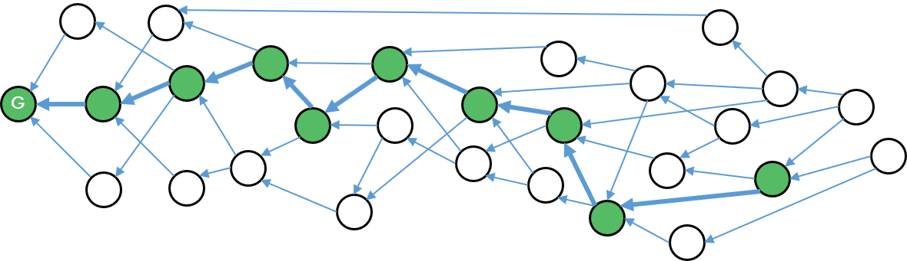
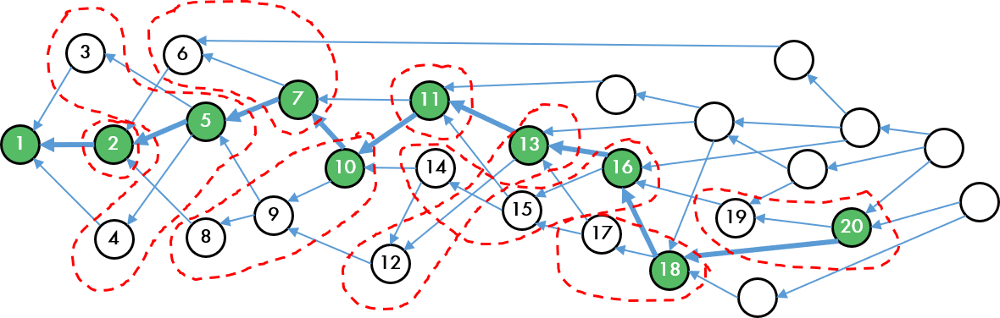
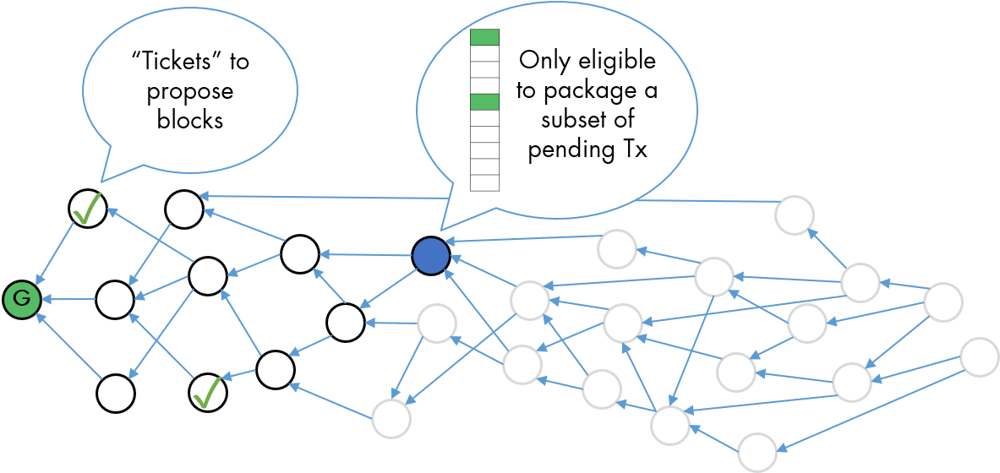

# Taraxa Whitepaper - Building IoT’s Trust Anchor

version: 0.9.3

**Disclaimer**: this white paper is intended as a preliminary technical overview of the Taraxa protocol and ecosystem and is not meant to be comprehensive or fully finalized.


<br /><br /><br /><br />
## Abstract

The advancement of IoT ecosystems has been consistently held back by technical challenges in security, maintenance, data provenance, and incompatible standards, as well as by business challenges in a generally lacking or lackluster use cases, strategically-risky platform lock-ins, and intentionally-siloed data management, and an increasing social awareness and demand for better privacy protection as devices become ubiquitous. Blockchain technology can help to address many of these challenges by building trust anchors into the ecosystem, thereby granting devices operational and economic independence, an awareness for asset ownership, and the capability to freely trade with one another. 
In this whitepaper, we introduce Taraxa, a public ledger focused on building trust anchors for IoT ecosystems with the following innovations, 

* **Rapidly-finalizing DAG** to maximize throughput and minimize inclusion & finalization latency
* **Fair & efficient proposals** to enable a PoS system to produce fair, efficient, and non-coordinated block proposals   
* **Transaction jurisdiction** to minimize wasted work and maximize network-wide parallel processing 
* **Speculative concurrency** to minimize transaction execution latency
* **Adaptive protocol** to help the network learn and adjust its governing parameters on the fly
* **Trustless light nodes** that can verify what it’s been told by full nodes 


<br /><br /><br /><br />
## Table of Contents

<br />

[1. Introduction](#1-introduction)

&nbsp;&nbsp;&nbsp;&nbsp;[1.1 The Promise of IoT](#11-The-Promise-of-IoT)

&nbsp;&nbsp;&nbsp;&nbsp;[1.2 How Blockchain Technology Could Help](#12-How-Blockchain-Technology-Could-Help)


[2. Review of Existing Projects](#2-Review-of-Existing-Projects)


[3. Taraxa Architecture](#3-Taraxa-Architecture)

&nbsp;&nbsp;&nbsp;&nbsp;[3.1 Design Principles](#31-Design-Principles)

&nbsp;&nbsp;&nbsp;&nbsp;[3.2 Ledger Architecture Overview](#32-Ledger-Architecture-Overview)

&nbsp;&nbsp;&nbsp;&nbsp;[3.3 Concurrent VM Architecture Overview](#33-Concurrent-VM-Architecture-Overview)


[4. Core Consensus](#4-Core-Consensus)

&nbsp;&nbsp;&nbsp;&nbsp;[4.1 Brief Background](#41-Brief-Background)

&nbsp;&nbsp;&nbsp;&nbsp;[4.2 Ordering via Anchor Chain](#42-Ordering-via-Anchor-Chain)

&nbsp;&nbsp;&nbsp;&nbsp;[4.3 Rapid Finalization](#43-Rapid-Finalization)

&nbsp;&nbsp;&nbsp;&nbsp;[4.4 Fair & Efficient Proposals](#44-Fair--Efficient-Proposals)

&nbsp;&nbsp;&nbsp;&nbsp;[4.5 Transaction Jurisdiction](#45-Transaction-Jurisdiction)

&nbsp;&nbsp;&nbsp;&nbsp;[4.6 Adaptive Protocol](#46-Adaptive-Protocol)


[5. Concurrent Smart Contracts](#5-Concurrent-Smart-Contracts)

&nbsp;&nbsp;&nbsp;&nbsp;[5.1 Brief Background](#51-Brief-Background)

&nbsp;&nbsp;&nbsp;&nbsp;[5.2 Speculative Execution](#52-Speculative-Execution)

&nbsp;&nbsp;&nbsp;&nbsp;[5.3 Concurrent Schedules](#53-Concurrent-Schedules)

&nbsp;&nbsp;&nbsp;&nbsp;[5.4 Conflict Detector](#54-Conflict-Detector)

&nbsp;&nbsp;&nbsp;&nbsp;[5.5 Ongoing Research & Development](#55-Ongoing-Research--Development)


[6. Technical Roadmap](#6-Technical-Roadmap)


[7. Economics](#7-Economics)


<br /><br />
[References](#References)


<br /><br /><br /><br />
## 1. Introduction

<br /><br />
### 1.1 The Promise of IoT

Long has the prospect of billions upon billions of intelligent, connected, and autonomous devices freely communicating and coordinating with one another been held up as an unquestioned vision for the future. The confluence and rapid advancement of technologies such as ever-more precise sensors and actuators, cloud computing, and near-ubiquitous connectivity have all made this vision seem increasingly likely. The market is full of audacious predictions of the world full of trillions of connected devices and the market for IoT reaching hundreds of trillions of dollars in market size. 

Yet, with each passing year, that promise has remained just that, a promise. 

For IoT to fully realize its promised potential, we would require a far more rapid pace in collecting and sharing of that collected data. IoT’s core value lies in the insights generated from the data collected by devices, which then in turn enable devices and humans to act upon these insights to generate value, eventually driving towards completely autonomous behaviors. As it stands today, the rate at which new data is being collected is slow, and the rate of sharing (and trading) of data is glacial. While by and large the sector has moved beyond the basic “what is IoT” understanding gap, it is nevertheless being held back by a set of very practical obstacles. 

**Technical obstacles**
Existing IoT infrastructures face a myriad of challenges as they scale up and eventually reaches trillions of autonomous devices. Centralized governance systems are ill-equipped to handle security as they present a single point of failure, they tend to scale poorly with workload as most device to device interactions tend to be localized, data collected by devices face questions of authenticity and provenance, and manufacturers in an attempt to create moats around their markets intentionally build in incompatible communication standards resulting in huge numbers of fragmented silos that take herculean costs and efforts to integrate. 

**Business obstacles** 
Due to the fundamental nascent nature of IoT systems as well as the various technical challenges, business cases for deploying large-scale IoT networks are often difficult to justify. The effort to discover financially-sound business cases are often hampered by data sensitivities tied to a fear of leaking trade know-how. Finally, with the rise of mega platforms and infrastructure players, businesses are becoming increasingly aware of the strategic risk of tying themselves into these centralized gardened walls, leaving them with a significantly-weakened bargaining position. 

**Social obstacles** 
With the rapid proliferation of digitized technologies, the public at large has become increasingly aware of the omnipresence of data-collecting sensors as well as concerned about how they’re being used. Recent data leaking scandals [[1]](#r1) [[2]](#r2) and the EU’s GDPR [[3]](#r3) have all placed privacy and data ownership at the center of civil discourse. If IoT as a technology is to continue proliferation, it must address data privacy concerns head-on and provide socially-acceptable solutions to guarantee secure data ownership and usage without triggering innovation-killing regulatory backlashes.

These and many more obstacles prevent the rapid adoption and value actualization of IoT in general. 


<br /><br />
### 1.2 How Blockchain Technology Could Help 
Blockchain technology (for this section the term blockchain is used to refer generally to decentralized ledger technologies) has given us a tool for a decentralized set of participants to collaborate, trade, and compete without preestablished trust, radically diminishing or in many cases completely removing the need for centralized systems to provide guarantees and coordination. This decentralization has several interesting consequences as applicable to IoT. 

**Fractionalizing Resources**
Decentralization enables society at large to unlock underutilized assets such as storage, bandwidth, and computing power. Think of it like a shared economy without the centralized platform (shared riding without Uber, shared rooms without Airbnb), where idle resources could be more fully leveraged. This type of sharing also has the added effect of lowering the minimum purchase size for the individual or the small business owners, for whom in the past setting up an IoT infrastructure is prohibitively expensive. 

**Decentralized Security and Responsibility**
No longer are centralized coordination authorities necessary to facilitate transactions or maintenance updates. Blockchain enables fully decentralized networks (without single points of failure) that is far more secure and transparent. Hacking a single device wouldn’t get you access to a million IoT devices, just one, and the rest of the network hums along, significantly raising overall network security. Each device and device owner are now masters of their own device, its security, and the data it produces, making network maintenance a far more manageable task. 

**Open Source Ecosystem**   
One of the core features of public ledger ecosystems is that the underlying technology is all open-source, without which participants cannot be sure to trust the code that runs the ecosystem. This type of open-source ecosystem not only minimizes the risk of becoming platform-dependent (anyone can replicate the ecosystem at any given time if they choose to do so). For IoT data owners who may be reluctant to rely upon external platforms for mission-critical analytics, they can be sure that platform is fully decentralized, transparent, and free for anyone to duplicate, should they find any part of the ecosystem to their dissatisfaction. 

**Democratization of Data**
Blockchain can eventually enable devices to trade data with one another, enabling the much-heralded machine-to-machine economy. In time this economy will develop its own assets, pricing and reputations, each device its own business. With more sophisticated AI even generate its own algorithms to make use of the data available to maximize its own interests. By democratizing data, innovation (and business cases) would more readily and spontaneously blossom as ever more participants are granted access. 

Integrating blockchain technology into IoT would prove a significant boon to the space, enabling more data to be more freely shared and traded, triggering an explosive emergence of hitherto unthought-of applications. 


<br /><br /><br /><br />
## 2. Review of Existing Projects

There are several blockchain projects purported to target the IoT space. Here we take a brief look at a few well-known projects. 

* IOTA uses a DAG-based Tangle instead of a linear ledger. It is miner-less and fee-less, achieved by having every node perform the tasks of verifying each other’s transactions. However, a finalized consensus protocol has yet to be published, currently relying on a closed-source, centralized coordinator to order and validate transactions. 

* HDAC is based on MultiChain, with a focus on mediating transactions and permissions between various public and private blockchains, with HDAC adding innovations such as an ePOW consensus in its private chain implementations. 

* VeChain is a DPoS-based chain, with permission-less participation but permissioned miner eligibility and governance model. Its applications are primarily focused on product lifecycle management. 

* IoTeX, adopts a chain of chains topology, enabling different IoT ecosystems to create their own sub-chains that can transact with one another through the root-chain, with a consensus algorithm similar to those proposed in Algorand and Dfinity (random selection of block proposal and validation committees). IoTeX also has functionalities to maintain transactional anonymity. 


Many important IoT use cases such as data anchoring are stateless transactions, whereby the key figure of merit for the blockchain network is simply block inclusion (see [Section 4](#4-Core-Consensus)) instead of full finalization. Taraxa’s unique topology allows for a decoupling of inclusion as an asynchronous and independent network activity versus finalization & execution, allowing devices to get much faster feedback without having to wait for the remaining parts of the consensus. 

Device transactions also heavily depend on smart contracts. Taraxa combined the benefits of a fast-advancing DAG topology and the instant and fair finality of a VRF-driven PBFT process (see [Section 4](#4-Core-Consensus)), giving smart contracts with state-dependent logic a definitive guarantee of immutability – not a probabilistic one.

To support the role of smart contracts in device transactions, Taraxa’s unique use of speculative concurrency (see [Section 5](#5-Concurrent-Smart-Contracts)) in the construction of a concurrent VM drastically boosts execution speed, saving precious time for the entire network of full validating nodes.

All networks evolve over time, and the best networks smoothly adapts to these evolutionary changes. Much of blockchain network’s evolution instead of happening automatically have taken place in online forums and offline meetings, often regressing into vicious and nonproductive disputes. Taraxa’s protocol is designed to seamlessly reach consensus on key network behavioral attributes such as block generation rate, block size, and shard jurisdictions, without all the fuss and drama. 


<br /><br /><br /><br />
## 3. Taraxa Architecture  

<br /><br />
### 3.1 Design Principles

Taraxa abides by the following set of design principles. 

* **Maximum concurrency**: Taraxa maximizes both horizontal as well as vertical concurrency to be inclusive of all work done and make sure all hardware resources are fully leveraged in transaction processing & validation. 

* **Minimum waste**: every node only does the work that’s necessary, when they’re randomly designated to do so, with all work done included, minimizing overlaps and waste, and all done with almost no coordination overhead. 

* **Device-conscious**: Taraxa assumes that most of the nodes on the chain will be IoT gateways, with our protocol built to reflect the processing, memory, and bandwidth limitations of these devices. We will also provide hardware reference designs and work with our partners to integrate them into their systems. 

* **Developer-friendly**: Taraxa aims for maximum backwards-compatibility by adopting an EVM-compatible toolchain to ensure that most developers do not need to learn a new set of languages & tools. Over time, Taraxa will adopt the WebAssembly compilation target to provide a more provably secure execution environment. 


<br /><br />
### 3.2 Ledger Architecture Overview

The Taraxa ledger roughly takes the following architectural approach. More details are found in Section 4 and Section 5. 

<br />   <br />

Taraxa’s core architecture is divided into two parts, a block directed acyclic graph (DAG) at the top and a Finalization Chain at the bottom. 

The block DAG is where blocks are proposed, validated, but not executed. This allows the DAG to grow quickly and decouples block inclusion from finalization and execution, a unique advantage to many stateless IoT use cases. The DAG layer provides the vital function of allowing for fast and fair consensus on transaction ordering and solves the blockchain tradeoff between security and fast block creation rate.

The DAG is divided into Periods, bounded by Period Blocks that are finalized through a VRF-enabled PBFT voting process. This voting process produces a linear chain of ordering and execution commitments in the form of blocks on a separate Finalization Chain. Once a Period Block in the DAG has been finalized, all blocks belonging between two finalized Period Blocks have deterministic ordering. 

<br /><br />
### 3.3 Concurrent VM Architecture Overview 

Taraxa’s concurrent VM consists of the following components. 

 
<br />   <br />

There are two phases: schedule discovery and validation. 

During discovery, the Scheduler takes input in the form of a block, instantiates multiple instances of the VM. The Conflict Detector monitors all read / write operations occurring while the instances are running, keeping a log of state changes and terminating instances that conflict, scheduling them for sequential execution, resulting in a Concurrent Schedule consisting of a concurrent set followed by a sequential set. In some instances, the conflicts are reported not directly by the VM instances but by a set of Concurrent Objects designed to be conflict-aware. The Concurrent Schedules are sent to the consensus layer, so the network reaches agreement. 

During validation, the remaining nodes (most nodes that were not part of the consensus process) now follow the agreed-upon Concurrent Schedules to rapidly execute the blocks, resulting in significant time savings for the entire network overall. 


<br /><br /><br /><br />
## 4. Core Consensus  

<br /><br />
### 4.1 Brief Background

As the blockchain space matures, pioneering networks such as Bitcoin [[5]](#r5) and Ethereum [[6]](#r6) have run into scalability bottlenecks. One of the key scalability metrics is total network throughput, usually measured by transactions per second (TPS). For single-chain topologies, however, increasing TPS necessarily means a decrease in security, the recovery of which negates any TPS gains. 

To increase TPS, the network could increase block size β and/or block generation rate γ. Increasing β necessarily increases network delay δ, because a bigger block of data takes longer to transmit. This in turn reduces the timeliness with which all nodes hear about the block, thus increasing the likelihood of branching. Increasing γ has the effect of increasing the number of blocks proposed on the network, but since on a single-chain topology only a single block can ever be accepted, more blocks actually increases the options nodes have to make the incorrect bet on the longest chain, leading to branching. Hence, we see a hard tradeoff between TPS and security [[4]](#r4).   The loss of security is attributable to the fact that while honest nodes are not coordinated, whereas as a malicious adversary can coordinate off-chain to produce a branch-free set of blocks and thus determine the longest chain.   


* **βγ ∝ TPS**: block size and block generation increase TPS
* **β ∝ δ**: block size increase network delay 
* **δγ ∝ branching**: network delay and block generation increase branching (decreases security)

One elegantly simple approach is to abandon the single-chain approach and adopt an inclusive approach in the form of a DAG [[7]](#r7), or specifically a block DAG. In a block DAG, blocks could be proposed by multiple nodes and they would all be accepted if they were valid. Additionally, unlike in a single-chain topology, each block could reference not just a single parent, but multiple parents – in fact as many parents as the proposing node sees tips in their current view of the DAG. A critical property of such a DAG is that that it removes the hard tradeoff between TPS and security, as the network could reliably increase β without sacrificing security. To see why this is, recall that increasing β would lead to an increase in branching.  However, instead of following the simple longest chain rule of a linear blockchain, the acknowledged parent and tips recorded into each block be used to provide crucial information for block ordering.  Without the additional overhead of voting, the ability for one block to point to another is a de-facto vote that the blocks referenced as parents and tips should be ordered ahead of the new block.  This key property can be combined by the use of the GHOST rule to create an inclusive block protocol that maintains security independent from branching rate [[7]](#r7).    


<br />   <br />

However, the block DAG topology isn’t without its own set of challenges, here are a few, 
* Ordering convergence
* Finality (confirmation latency)
* Block efficiency - too many blocks 
* Block efficiency - overlapping block contents 

Taraxa sets out to address these issues. 


<br /><br />
### 4.2 Ordering via Anchor Chain

To ensure that the block DAG reaches rapid convergence amongst nodes, we note that not all parent block references need to be equal. The ordering algorithm originally proposed by GHOSTDAG [[7]](#r7) takes a two-step process: separating the DAG into blue vs. red clusters, and then using the GHOST rule to map out an induced chain within the blue cluster.

Here we note that you could remove the need for the initial clustering by simply allowing implicit voting via the block pointers on what each of the proposers think happens to be the heaviest block (analogous with Bmax in GHOSTDAG) at the time of the proposal. This idea was first proposed by the OByte (formerly Byteball) project [[8]](#r8) whereby one of the parents referenced is called the “best parent”. Unlike in OByte, the best parent is not determined by a predefined set of witnesses, but rather by the tool we already have at our disposal, the GHOST rule. 

<br />   <br />

At any given moment, a node can independently calculate which of the tips on the DAG it observes is the heaviest tip according to a modified version of the GHOST rule. In the original GHOST rule, all pointers are of equal weight. In Taraxa, the weight calculations only involve GHOST pointers – those that the proposing nodes calculated to be the heaviest. The remaining regular pointers are involved in total ordering. This mechanism guarantees an exponential falloff of reordering risk within the block DAG over time, and that different nodes’ view of which blocks are considered the heaviest blocks rapidly converge over time.

Taraxa’s use of Periods (see [Section 4](#4-Core-Consensus).3) help to bound the complexity of the weights calculations, as the traversal stops upon hitting blocks that are members of a previously finalized Period.

From any block on the block DAG by following the heaviest blocks forward (towards the newest blocks), we can construct an Anchor Chain inside the DAG, much like the Main Chain proposed by OByte. 

<br />   <br />

Here’s a breadth-first algorithm which calculates weights for a yet-to-be-finalized Period, which is executed whenever a new block is being proposed. 

```
--------------------------------------------------------------------------------
Algorithm 1: calculate the weights of each block in a non-finalized Period
--------------------------------------------------------------------------------
Input: S – a set of tips visible to the node
Output: W – a dictionary of blocks and weights for the current non-finalized Period
  1:  function CALCULATEWEIGHTS (S):
  2:    current_layer ← S
  3:      while current_layer is not empty:
  4:        for each block in current_layer:
  5:          parent ← GHOST parent of block  
  6:          if parent does not belong to a finalized Period then 
  7:            if parent is not in parent_layer then
  8:              add parent into parent_layer
  9:              insert parent into W with a weight of 1
  10:            else
  11:              increment W(parent)’s weight by W(block)
  12:        current_layer ← parent_layer
  13:        parent_layer ← {empty set}
  14:   return W
  15: end function
--------------------------------------------------------------------------------
```

In practice, as blocks are continuously added to the DAG the weights are updated and the Anchor Chain is calculated by the simple traversal of the GHOST path. The Anchor Chain is used to later determine total ordering between two Period Blocks, and the tip of the Anchor Chain is viewed as the block that all honest nodes should build off of, in that a newly proposed block’s ghost pointer will point to the tip of the Anchor Chain. 

Below is an algorithm which determines the Anchor Chain. Here we assume that, unlike a typical DAG, there exist forward pointers from parent to the child block that has a GHOST pointer pointing back to it. In actual implementation such relationships are generated and discarded at runtime. 


```
--------------------------------------------------------------------------------
Algorithm 2: calculate the Anchor Chain
--------------------------------------------------------------------------------
Input: P – previous Period Block, W – a map of blocks and weights for the current non-finalized Period
Output: anchor_chain – a set (that preserves insertion order) of blocks that form the Anchor Chain 
  1:  function FINDANCHORCHAIN (P, W):
  2:    current_block ← P
  3:    while current_block has children:
  4:       children_weights ← map (block, weights) from current_block’s children ∩ W on block references
  5:        heaviest_child ← the block with the maximum weight in children_weights
  6:        add heaviest_child to the end of anchor_chain
  7:        current_block ← heaviest_child
  8:    end while
  9:    return anchor_chain
  10: end function
--------------------------------------------------------------------------------
```

Total ordering, for a given DAG, becomes completely deterministic once the Anchor Chain is calculated. Traverse the block DAG starting from the previously-finalized Period Block down the Anchor Chain, and for every Anchor Block, find its parents (excluding the previous Anchor Block) which constitutes an epoch. Topologically sort the epoch with tie breaking via the lowest block hash and keep moving down the Anchor Chain until it has been exhausted.  

<br />   <br />

```
--------------------------------------------------------------------------------
Algorithm 3: calculate the total ordering of the block DAG  
--------------------------------------------------------------------------------
Input: anchor_chain – a set of blocks that form the Anchor Chain for the currently non-finalized Period
Output: ordering – total ordering of the currently non-finalized Period 
  1:  function ORDERPERIOD (anchor_chain):
  2:    for each anchor_block in anchor_chain:
  3:      epoch ← set of parents for anchor_block, excluding the previous block in the anchor_chain
  4:      sorted_epoch ← topologically-sorted epoch, with tie-breakers via lowest block hash
  5:      add sorted_epoch to the end of ordering
  6:    return ordering
  7:  end function
--------------------------------------------------------------------------------
```

<br /><br />
### 4.3 Rapid Finalization

In many blockchain networks, finality is a matter of probability. For example, in Bitcoin the convention is to wait for a transaction to be 6 blocks deep [[9]](#r9) (which takes on average 60 minutes) into the chain before accepting it as “finalized”, however the risk of network reordering is never zero, and the exact probabilities depend on the assumed hash power of the attacker.  The longest chain rule provides eventual finality, if you wait infinitely long, but not true or instant finality. 

This lack of instant true finality also applies for the block DAG, whereby the reordering risk falls off exponentially but at not instant ever becomes zero. This may be acceptable for small, coin-only transactions, but often unacceptable for high-valued transactions and especially for smart contracts. 

Smart contracts (more on Section 5) are logic built on top of the blockchain. Unlike simple coin transfers which exhibit only a single behavior – modifying the states of two predefined accounts, a smart contract could (and often do) impact many accounts at once, many of those could themselves be smart contracts and trigger a large-scale cascade of impact. On top of which, many smart contracts implement mechanisms with branching conditions based on previous states – e.g., auctions and trading algorithms. All of this makes having a truly finalized state critically important. 

To quickly reach true finalization, we use a VRF-enabled fast PBFT process first proposed by the Algorand [[10]](#r10) project, in which a randomized subset of the network is chosen to cast a vote, through a process of sortition. Unlike in Algorand and other similar protocols, this vote in Taraxa is far simpler and is asynchronous with block generation. 

As the block DAG grows, the network takes successive votes to place “infinite” weight on a specific Anchor Block, which then becomes a Period Block. The irrevocable commitment of Anchor Block selection by byzantine agreement is thus adapted to GHOST rule by treating the commitment as “infinite” weight, thereby short-circuiting the need to wait an infinite time.  Having committed to an Anchor Block, the finality is instantaneous. The voting result is encoded into blocks on the Finalization Chain (see Figure 1). This vote is very simple because it is not a vote on the contents or the validity of the block – that has been achieved already when constructing the block DAG by implicit voting through gossiping the block throughout the network – but purely on whether or not this is the Anchor Block that should become a Period Block. A much simpler vote means the voting process is much faster, as there are less assertions to validate among the randomly-selected committee members. Once a Period Block has been finalized, all blocks connected between the new Period Block and the last Period Block now have a deterministically-defined (in other words, finalized) ordering, forming a new Period within the block DAG. 

Encoded inside the blocks on the Finalization Chain are not just the Period Block and their associated votes (multi-signature is on the roadmap) but also a concurrent schedule (see [Section 5](#5-Concurrent-Smart-Contracts)) of all transactions within all the blocks included in the Period. A critical function during this process is to also identify overlapping transactions between blocks - for network reliability and security purposes, the overlap cannot be zero - so that they are removed from the aggregate schedule. A transaction is considered overlapping if, after the absolute ordering of the blocks have been established, transactions occurring in a later block has already appeared in an earlier block, then the one in the later block is considered overlapping and removed. The associated fee rewards for processing overlapping transactions are also removed. To further incentivize honest behaviors during block proposals, blocks in the DAG that exceed a certain overlap percentage will not receive block rewards.   

This finalization process is asynchronous to block generation. As the block DAG at the top grows, it is only concerned with transaction inclusion – in fact nodes do not even execute the transactions within the blocks. The block DAG is just for block validation, transaction inclusion, and fair transaction ordering and grows completely independently of the finalization and execution process that happens through voting. 

This decoupling of transaction inclusion vs. finalization & execution has a particularly interesting use case for stateless transactions, often found in applications involving IoT sensor data anchoring. A stateless transaction is one where the transaction has no logical relationship with other transactions, hence no subsequent transactions would depend on such stateless transactions. IoT data anchoring, where an IoT device periodically hash data sets collected over time and commit them into the blockchain, is a stateless transaction. Hence a stateless transaction is only concerned with transaction inclusion, which guarantees that it has made it into the blockchain, and since any amount of subsequent reordering has no impact on their validity, an IoT device has no need to wait for a finalization signal before anchoring another set of data. 

Lastly, having finalized periods across the block DAG effectively caps the computational complexity of calculating weights via GHOST, as any node only needs to recursively calculate weights until it hits a confirmed Period Block. 


<br /><br />
### 4.4 Fair & Efficient Proposals

The first driver of wasted blocks is that there could simply be too many blocks if no rate-limiting mechanisms are in place. Classic blockchain projects like Bitcoin and Ethereum relies on Proof of Work (PoW) as a way to rate-limit block generation, but Taraxa uses a Proof of Stake (PoS) and we believe that the sheer amount of energy expended by PoW is not sustainable or socially responsible – we’d need a non-energy destroying method of limiting block generation rates. 

Taraxa developed an algorithm that drives Fair and Efficient Proposals by leveraging Verifiable Random Function (VRF) and Verifiable Delay Function (VDF). VRF was first proposed by Micali et al. [[11]](#r11). It is a pseudo-random function which provides a proof of the outputs' correctness. VRFs also have the added property that the output is indistinguishable from a uniform function given an unpredictable input. VDF is a function that is meant to take a prescribed amount of time to compute, is highly resistant to parallel computations (i.e., avoids the hardware arms race of PoW), and whose output is extremely fast to verify. Taraxa makes use of a VDF first described by Wesolowski [[12]](#r12). 

<br />   <br />

At any given moment, a node's eligibility to propose a block requires the successful computation of a VDF with a difficulty factor set by a VRF. The VRF's inputs are simply the signature of the latest observed Period Block hash and the current level of the block DAG at which the node wishes to propose a block. The VDF is then adjusted for difficulty according to the output of the VRF, and the VDF's inputs are the block hash of the terminating DAG tip of the computed Anchor Chain, and the same inputs as the VRF. 

This method allows any eligible node to propose a block once the VDF has been properly computed, removing the possibility of deadlocks occurring on the block DAG (i.e., no blocks are produced). However, the other implication of this property is that since blocks can always be proposed, we could end up with as many blocks as eligible node proposing nodes, potentially opening the network to block DAG reordering attacks. 

To resolve this, we define a difficulty threshold, beyond which a block has no weight via the GHOST rule and hence cannot increase the weight of any blocks they point to, effectively removing their impact in ordering. While after computing the VRF for the current level, a node should immediately know whether or not its difficulty exceeds the threshold. This however should not prevent an _honest_ node from keep computing the VDF as there's always a non-zero chance of deadlock - i.e., the statistically improbable outcome that all eligible nodes computed VRF that exceeded the difficulty threshold. An honest node would continue on to compute the VDF, while monitoring the network traffic. If the honest node observes that the expected number of blocks at the current level as defined by the difficulty threshold has been gossiped around, then it should stop computing the VDF and start a new VRF-VDF cycle for the next level, as the block it will eventually produce at the previous level is likely going to be heavily overlapping with those already produced and hence no longer useful to the network. As long as the expected number of blocks at the level is not observed, the honest node will keep calculating the VDF to its conclusion and produce its intended block. 

Note that it is also financially unprofitable to add blocks into the block DAG after observing a good many blocks appearing at the current level. The "late" block is guaranteed to be ordered behind the previously observed blocks, and because it is late, its transactions have a high probability of overlapping with those blocks that came before. Since the finalization process removes  overlapping transactions, the late block producer receiving little to no rewards from fees. Rules could also be instituted that block rewards are also tied to a minimum threshold of block efficiency, refusing payout to those nodes producing blocks with a high percentage of overlapping transactions. 

The algorithm below describes a node's decision-making process while proposing. 


```
--------------------------------------------------------------------------------
Algorithm 4: block proposal eligibility  
--------------------------------------------------------------------------------
Input: period_block_hash - latest period block's hash, level - the level of the block DAG to build on relative to the latest period block, anchor_tip_hash - current anchor chain's tip on the block DAG, difficulty_threshold - the difficulty beyond which the block will no longer have weight in the GHOST rule, no_expected_blocks - number of expected blocks at the current level 
Output: eligible - whether the node should publish, proof - proof of eligibility
  1:  function PROPOSALELIGIBILITY (period_block_hash, level, anchor_tip_hash, difficulty_threshold):
  2:    rnd ← VRF (S(concatenate( period_block_hash, level)))
  3:    difficulty ← ( rnd / MAX_VRF_INTEGER_OUTPUT ) * difficulty_threshold
  4:    VDF_d ← VDF_function_generator (VDF(), difficulty)
  5:    output_vdf ← concatenate(anchor_tip_hash, period_block_hash, level)
  6:    for i = 1 to difficulty
  7:      output_vdf ← VDF_d (output_vdf)
  8:      cur_blocks ← most updated number of blocks seen through gossip at the current level
  9:      if cur_blocks >= no_expected_blocks then
  10:       eligible ← false
  11:       proof ← null
  12:       return (eligible, proof)
  13:   eligible ← true
  14:   proof ← (output_vdf, period_block_hash, anchor_tip_hash)
  15:   return (eligible, proof) 
  16: end function
--------------------------------------------------------------------------------
```


<br /><br />
### 4.5 Transaction Jurisdiction

The second driver of wasted blocks is that transactions contained within different blocks could overlap with one another, causing redundancy. The most basic strategy to control this is to require that when a block is proposed, it contains none of the transactions included in the tips (parents) it is referencing. The proposer further has no financial incentive to reference older transactions in non-tip blocks as its block would likely either be rejected as malicious, or that these redundant transactions will be pruned during execution and proposer would have received nothing for its efforts. But this basic approach is often not enough if transactions begin to flood the network. 

Taraxa implements an algorithm that defines Transaction Jurisdiction for each node when they propose blocks in order to minimize overlap. 

 
<br />   <br />

To define transaction jurisdiction, a proposer follows an algorithm that places it into a specific range of transaction addresses (or accounts) for which it has jurisdiction over. In other words, the proposer is only eligible to pack transactions from addresses within its jurisdiction into a new block. A proposer first signs an Anchor Block and then hashes the signature, receiving a certificate. This certificate is then mapped into the pool of pending transactions to see which ones the current node is eligible for. This could be done via a simple modulus operation, for example, as described in the simple algorithm below. 

```
--------------------------------------------------------------------------------
Algorithm 5: find transactions within the proposer node’s jurisdiction
--------------------------------------------------------------------------------
Input: P – pool of pending transactions, N – number of jurisdictional shards, past_period_block_id – the id of a past period block (e.g., the past 2nd from the current non-finalized Period) 
Output: available_tx – subset of pending transactions this node has jurisdiction over 
  1:  function FINDTXJURISDICTIONSET (P, N):    
  2:    jurisdiction_cert ← hash of the proposing node’s signature of past_period_block_id
  3:    for each transaction in P:
  4:      if (transaction modulo N) equals (jurisdiction_cert modulo N) then
  5:        add transaction to available_tx
  6:    return available_tx
  7:  end function
--------------------------------------------------------------------------------
```

Note that the block id of the past Period block and its signature need to be part of the block to act as proof to help other nodes to validate whether the correct jurisdiction has been used. For each such jurisdiction proof generated, it will remain valid for two (2) Periods to account for fuzzy boundary conditions between Periods due to propagation latency. 

Also note that, the implicit definition of work load in this algorithm is simply the transaction count. This is a reasonable measure of load during block generation since, in the Taraxa protocol, blocks on the block DAG are not executed immediately so the resulting computational load is purely based on validation, which is a relatively simple and fixed workload for both coin and smart contract transactions. 

In both cases, there is no coordination between the nodes on block proposal eligibility and transaction jurisdiction and a certain amount of tolerance or “fuzziness” is built into the validation, thereby reducing the associated network overhead and attack surface. 


<br /><br />
### 4.6 Adaptive Protocol

Network conditions are constantly changing, and the rules governing protocol behaviors should likewise adapt – automatically – not via offline meetings, online forums, or instant messaging.

Since Taraxa already uses a fast PBFT process to confirm Period Blocks, these blocks could easily contain updated parameters based on recent network conditions, parameters such as block generation rate, block size, VRF committee sizes, or even networking protocols. These parameters could all be calculated and determined dynamically on the fly based on real-time network conditions, hence minimizing the need for hard forks and flame wars.

For example, ideally speaking, the expected value of the product of the number of eligible block generators and number of transaction jurisdictions should be \~1. If the product is significantly less than 1, then the network suffers from a high orphan rate. If it is significantly higher than 1, then the network has poor block efficiency. To ensure the network stays at and around optimum performance requires continuous parametric calibration and consensus on these calibrations.


The machine learning algorithms that govern how these parameters are calculated are an ongoing research topic for Taraxa, and we will release our findings as we move forward. 


<br /><br /><br /><br />
## 5. Concurrent Smart Contracts 

<br /><br />
### 5.1 Brief Background

Brief preface: Taraxa’s work on concurrency is inspired by the work of Professor Maurice Herlihy and the pioneering papers [[13]](#r13) [[14]](#r14) on smart contracts and concurrency written under his supervision. Taraxa is fortunate to have Professor Herlihy as our advisor on concurrency and distributed systems technology, and to have had the privilege to collaborate with many of these papers’ authors. 

Blockchain technology began and was popularized by the arrival of Bitcoin, which primarily served as a way for users to conduct transactions without a centralized third party. As blockchain technologies evolved, an additional layer was added between the client and the underlying ledger, often called smart contracts, which is a set of logic that enables more sophisticated applications to be written on top of the blockchain. One of the earliest and most widely-used implementations of such a smart contract system is a core feature of the Ethereum [[6]](#r6) project. For the purposes of this whitepaper, we will primarily use Ethereum as a point of reference when talking about smart contracts. 

A smart contract is similar to an object in a programming language, it has a persistent state (object variables) and a set of functions. Functions could be called directly by a client or by other contracts to alter its own persistent state. In Ethereum, the processing of contracts costs gas, which is paid with ETH, the Ethereum network’s native cryptocurrency. The preferred smart contract programming language in Ethereum is Solidity, which compiles into a Turing-Complete bytecode. 

In Ethereum, every miner pulls in contract calls (and value transfers), orders them into some sequence, process them, record the resultant new states (locally) and pack the contracts’ state transitions into a new block and then publish onto the ledger. Whoever’s proposed block ended up on the longest chain wins and earns the gas fees of the contracts and transactions packed into the block. 

All smart contract processing is performed sequentially in Ethereum. This is most likely an explicit design choice, as many contract calls, if processed in parallel, will result in conflicting accesses to persistent storage. Also given that Solidity is a Turing-complete language, it is not possible statically determine which smart contract calls will lead to conflicts and hence cannot be avoided ahead of time. 

To achieve concurrency, we borrow some techniques from software transactional memory (STM). Most concurrency today is enabled by locking-based techniques, which places a great deal of burden on the developer to make correct design decisions with regards to granularity and minimize lock contention and deadlocks. In fact, this approach towards concurrency tends to become so complex that in practice most developers simply avoid concurrency altogether. STM on the other hand takes the burden off the developer and by optimistically executing transactions in parallel, if a conflict is detected during runtime, the conflicting transaction’s changes are rolled back, and the transaction is re-executed at another time. Finalized non-conflicting changes are then committed to persistent shared storage. 

Compared to typical lock-based techniques, STM is much more easily adopted by coders as no additional effort is required. It also has the added benefit of being able to create atomic operations that are composable [[13]](#r13), making it much easier to collaborate and compose larger applications from smaller ones in a distributed manner. STM’s most obvious drawbacks are the additional coordination overhead incurred by keeping track of shared storage access as well as the cost of rolling back conflicting operations. 

In the context of smart contracts, from past studies [[13]](#r13), we see that at relatively low rates of conflict, STM techniques provides significant performance boosting. In Taraxa, we make multiple modifications to existing EVM (we’re using EVM as our initial step) as well as simulated financially-incentivized low-contention block packing behaviors to further minimize contention. 

<br /><br />
### 5.2 Speculative Execution 

As it stands today, all smart contract processes are done in sequential order on a single thread. Here we propose a way to process them in parallel, in order to greatly increase the processing throughput of smart contracts. 

There are several obstacles to running smart contracts in parallel. First, because smart contracts modify shared storage (their persistent storage), it’s crucial to keep track of which threads are accessing which areas of storage at any given moment to avoid conflicting access. Second, because the programming language is Turing-complete (e.g., Solidity on Ethereum), it is impossible to determine statically whether the different contracts will produce conflict during parallel execution. 

We propose that the Taraxa full nodes executes the smart contracts’ code as speculative actions. A full node schedules multiple smart contract calls for parallel execution, and then keeps track of their access to persistent storage via the Taraxa runtime APIs. Should there be conflicting access (i.e., read/write, write/write), the access is rejected, the conflict is reported to the scheduler, with the scheduler terminating the thread, rolling back its speculative changes to the persistent storage, and re-schedules these conflicting contract calls for sequential processing. 

Note that this is a highly-simplified version of speculative execution, as it involves the wholesale termination of an entire smart contract execution upon encountering any conflict. This approach is a subset of a more generalized approach whereby specific conflicts are tracked within each contract execution and are held for sequential execution, creating a fork-join schedule that could later be deterministically reproduced. This approach becomes increasingly relevant as smart contracts become increasingly sophisticated and complex. 

The next iteration of Taraxa’s concurrent VM will implement the more generalized case of speculative execution. 

<br /><br />
### 5.3 Concurrent Schedules

Because contracts are now processed in parallel, it’s important for every node to follow the same concurrent schedule. However, existing STM systems are non-deterministic, which means that even if several different nodes are given the exact same set of transactions and they speculatively execute them independently, they could end up with different concurrent schedules. Different concurrent execution schedules will often result in different end states, thus breaking the ability for nodes to validate each other’s proposed schedules and breaking consensus altogether. To ensure that all executions are perfectly deterministic, the network needs to guarantee that every node follows the exact same concurrent schedule for a given transaction set, which usually comes in the form of a block. This consensus is enforced on the Finalization Chain: right after a Period Block has been finalized, another vote is initiated to reach consensus on the concurrent schedules for every block in the newly-finalized Period, and the resulting set of concurrent schedules are encoded into another block which follows the Period Block finalization block. This voting process is governed by the same VRF-enabled PBFT process that enables the rapid finalization of the block DAG. 

During Concurrent Schedule discovery, a full node selects a set of smart contracts calls it wishes to process and then executes them in parallel, instantiating a separate VM thread for each call. Throughout the processes, it monitors the Conflict Detector for any alerts it may raise. If it sees a conflict, the Scheduler then terminates the process running the conflicting transactions and rolls back the changes to the State Log (proxy for persistent storage prior to committing the state changes) they’ve made. It then places the conflicting transactions into the sequential execution queue and executes them after the other parallel processes have completed. Throughout the entire process, smart contracts calls executed in parallel or sequence are recorded into a concurrent schedule S, which is then returned as the Scheduler terminates.

The pseudocode below describes the Concurrent Contract Scheduler run by the representative node to execute contract calls in parallel.

```
--------------------------------------------------------------------------------
Algorithm 6: process contracts in parallel
--------------------------------------------------------------------------------
Input: A set of smart contracts calls C selected by the representative node
Output: Commit a set of changes to persistent storage and publish a schedule S for validators to follow
  1:  function ConcurrentContractScheduler(C): 
  2:    Initialize the storage conflict detector T
  3:    Initialize the concurrent schedule log S
  4:    Initialize a sequential execution queue F
  5:    Execute all contract transactions c C, watch for alerts from the conflict detector T
  6:    if T raises alert of conflict on transaction c:
  7:      Roll back transaction c
  8:      Place transaction c into F
  9:    For each successful thread record the execution sequences into S
  10:   For each transaction f ∈ F execute them in sequence and record execution sequence into S
  11:   return S
  12: end function
-------------------------------------------------------------------------------- 
```

<br /><br />
### 5.4 Conflict Detector

The Conflict Detector tracks all memory access during the speculative executions instantiated by the Scheduler, and reports back conflicts which result in the termination, rollback, and placement of conflicting transactions into a sequential set. At the core of the Conflict Detector is a concurrent hashtable data structure which keeps track of all memory being accessed during speculative execution. 

Taraxa uses a linearizable set with an insert(key) operation that inserts key and returns True if key was not present in the data structure, and False otherwise. Keys stored in the set are pairs consisting of contract and storage addresses, which is the level of granularity at which data is loaded and stored in persistent storage.

Each node in the set is augmented with two additional fields: state and txn. The insert(key) function is modified to also accept a txn variable as an argument and return a node in addition to the original Boolean value. The returned node is the node found by insert if key was already present, or the newly-created node that now stores key. Each time a transaction txn wants to access a storage location addr, it must make a call to insert(addr, txn). The state variable can be equal to READ, SHARED, or WRITE, and represents which transactions may access the storage location addr. READ denotes a single reader, SHARED denotes multiple readers, and WRITE denotes a single writer. The READ state may change to either SHARED or WRITE, but once changed, it cannot transition to another state. The txn variable is the hash of the transaction that first accessed addr. 

The pseudocode below for a conflict detector that uses a modified linearizable set as described above. In the following, CAS refers to the compare-and-swap synchronization primitive. In our implementation, we used a C version of the dynamically-resizable concurrent hash table by Lie, Zhang, and Spear [[16]](#r16), a state-of-the-art data structure. As the original Java implementation depends heavily on the native garbage collector, we use the Boehm-Demers-Weiser garbage collector [[17]](#r17) for our implementation.

The pseudocode below describe the Conflict Detector used to track access to persistent storage and report conflicts back to the Scheduler.

```
--------------------------------------------------------------------------------
Algorithm 7: READACCESS(addr, txn)
--------------------------------------------------------------------------------
Input: Address addr, transaction txn
Output: Boolean indicating whether there was a conflict
  1:  function READACCESS(addr, txn):
  2:    call insert(addr, txn), which return node node.
  3:    if insert succeeded:
  4:      return True
  5:    read node.txn
  6:    if node.txn is equal to txn:
  7:      return True
  8:    read node.state
  9:    if READ:
  10:     do CAS(node.state, READ, SHARED)
  11:     if node.state is READ
  12:       return True
  13:     return False
  14:   else if SHARED:
  15:     return True
  16:   return False
  17: end function
--------------------------------------------------------------------------------
```

```
--------------------------------------------------------------------------------
Algorithm 8: WRITEACCESS(addr, txn)
--------------------------------------------------------------------------------
Input: Address addr, transaction txn
Output: Boolean indicating whether there was a conflict
  1:  function WRITEACCESS(addr, txn):
  2:    call insert(addr, txn), which return node node.
  3:    if insert succeeded:
  4:      return True
  5:    read node.txn
  6:    if node.txn is equal to txn:
  7:      read node.state
  8:      if READ:
  9:        do CAS(node.state, READ, WRITE)
  10        if node.state is WRITE:
  11          return True
  12        return False
  13      else if WRITE:
  14        return True
  15      return False
  16    return False
  17: end function
--------------------------------------------------------------------------------
```


<br /><br />
### 5.5 Ongoing Research & Development 

To unlock the full potential of concurrent execution, we are also embarking on the following research and development. 

* **Atomic counters** - it's hypothesized that most conflicts within smart contracts are generated by counters that are meant to enforce a range under or overflow, or simply used to record usage statistics. Writes into these counters are largely commutative actions for which order does not matter. Taraxa is in the process of implementing an algorithm that scans through a contract's bytecode to identify such counters and flag them, giving the EVM semantic understanding on how to properly handle actions performed on them, and not treating these actions as conflicts. This could significantly lower the rate of conflict incidence and thereby significantly improving the speedup through concurrency.  

* **Concurrent Merkle Tree** - write time dominates the overall EVM process once execution is made concurrent. The typical persistent storage Merkle data structure as defined by the EVM is non-concurrent. While a Merkle-ized tree does not lend itself naturally to concurrent accesss, write access into each element within a single layer of the Merkle tree can be parallelized.

* **Batch processing coin transactions** - a coin transaction may be too simple of an operation to justify the overhead of concurrency. Taraxa intends to experiment with methods of pooling coin transactions and executing coin transactions within each pool sequentially, but concurrently between pools. Coin transactions are sufficiently simple to statically analyze for conflicts - but not completely as the Turing-complete logic of contracts cannot be statically analyzed for conflicts with these coin transactions. 


<br /><br /><br /><br />
## 6. Technical Roadmap 

**Light nodes**
Protocol-level support for light nodes conducting randomized polling of the network, hardware ASIC to accelerate ECC computations on edge devices. 

**Concurrent VM**
Granular speculative execution with fork-join schedules, smart concurrent objects (e.g., counters) that are contention-aware, non-contentious contract templates, compilation into WebAssembly bytecode, smart contract tagging to make the network aware of intrinsically conflicting contracts, development of a new non-Turing complete programming language that allows for rapid validation without executing the entire contract, integration of off-chain concurrent smart contract processing. 

**Sidechains**
Addition of state-sharding sidechains for individual DApps, cross-chain transactions, automated random shuffling of validators across sidechains. 


<br /><br /><br /><br />
## 7. Economics

The Taraxa token, a native token of the layer 1 Taraxa ledger, is used as a means of exchange as well as fuel in the Taraxa ecosystem and is critical to the operations of the ecosystem. Full nodes will need to be paid a fee to process the smart contracts, and the purchase of IoT data for example is facilitated using the Taraxa token. 
A more comprehensive description of the ecosystem’s economic design will be published later and its summary will be integrated into this whitepaper. 


<br /><br /><br /><br />
## References


<a id="r1">[1]</a> K. Granville, "Facebook and Cambridge Analytica: What You Need to Know as Fallout Widens," The New York Times, 19 March 2018. [Online]. Available: https://www.nytimes.com/2018/03/19/technology/facebook-cambridge-analytica-explained.html. [Accessed 15 November 2018].

<a id="r2">[2]</a> D. MacMillan and R. McMillan, "Google Exposed User Data, Feared Repercussions of Disclosing to Public," Wall Street Journal, 8 October 2018. [Online]. Available: https://www.wsj.com/articles/google-exposed-user-data-feared-repercussions-of-disclosing-to-public-1539017194. [Accessed 15 November 2018].

<a id="r3">[3]</a> EU GDPR.ORG, "GDPR FAQs," EU GDPR.ORG, [Online]. Available: https://eugdpr.org/the-regulation/gdpr-faqs/. [Accessed 15 November 2018].

<a id="r4">[4]</a> Y. Sompolinsky and A. Zohar, "Secure High-Rate Transaction Processing in Bitcoin," 31 December 2013. [Online]. Available: https://eprint.iacr.org/2013/881.pdf. [Accessed 30 April 2019].

<a id="r5">[5]</a> S. Nakamoto, "Bitcoin: A Peer-to-Peer Electronic Cash System," 31 October 2008. [Online]. Available: https://bitcoin.org/bitcoin.pdf. [Accessed 30 April 2019].

<a id="r6">[6]</a> "Ethereum White Paper," [Online]. Available: https://github.com/ethereum/wiki/wiki/White-Paper.

<a id="r7">[7]</a> Y. Sompolinsky and A. Zohar, "PHANTOM, GHOSTDAG: Two Scalable BlockDAG protocols," 2018. [Online]. Available: https://eprint.iacr.org/2018/104.pdf. [Accessed 17 December 2018].

<a id="r8">[8]</a> A. Churyumov, "Byteball: A Decentralized System for Storage and Transfer of Value," 1 October 2016. [Online]. Available: https://obyte.org/Byteball.pdf. [Accessed 30 April 2019].

<a id="r9">[9]</a> "Bitcoin Confirmation," Bitcoin Wiki, [Online]. Available: https://en.bitcoin.it/wiki/Confirmation. [Accessed 30 April 2019].

<a id="r10">[10]</a> J. Chen and S. Micali, "ALGORAND," 26 May 2017. [Online]. Available: https://algorandcom.cdn.prismic.io/algorandcom%2Fece77f38-75b3-44de-bc7f-805f0e53a8d9_theoretical.pdf. [Accessed 30 April 2019].

<a id="r11">[11]</a> S. Micali, M. Rabin and S. Vadhan, "Verifiable Random Functions," in 40th Foundations of Computer Science (FOCS), New York, Oct 1999. 

<a id="r12">[12]</a> B. Wesolowski. Efficient verifiable delay functions. Cryptology ePrint Archive, Report 2018/623, 2018. https://eprint.iacr.org/2018/623.

<a id="r13">[13]</a> T. Dickerson, P. Gazzillo, M. Herlihy and E. Koskinen, "Adding concurrency to smart contracts," in ACM Symposium on Principles of Distributed Computing, 2017. 

<a id="r14">[14]</a> V. Saraph and M. Herlihy, "An Empirical Study of Speculative Concurrency in Ethereum Smart Contracts," arXiv.org, vol. Computer Science, no. Distributed, Parallel, and Cluster Computing, p. arXiv:1901.01376, 2019. 

<a id="r15">[15]</a> T. Harris, S. Marlow, S. P. Jones and M. Herlihy, "Composable Memory Transactions," in PPoPP, Chicago, 2005. 

<a id="r16">[16]</a> Y. Liu, K. Zhang and M. Spear, "Dynamic-sized nonblocking hash tables," in Proceedings of the 2014 ACM symposium on Principles of distributed computing, Paris, 2014. 

<a id="r17">[17]</a> H.-J. Boehm, "A garbage collector for C and C++," [Online]. Available: http://www.hboehm.info/gc/.